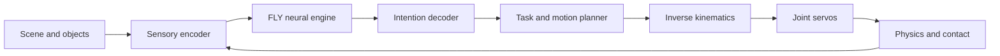

# Neurofly

### NVIDIA Neural Control Lab

**A small brain. A new reach.**

Neurofly is an experimental robotics prototype exploring a simple idea: **can a compact, fly-inspired neural controller make useful decisions for a robotic arm?**

The working prototype connects a recurrent fruit fly neural network to a simulated six-axis arm. The controller receives sensory information, evaluates available objects, and supplies intentions to a motion system that reaches, grasps, transports, and releases. Every action produces feedback for the next decision. You can watch the experiment, change its conditions, inspect the signals, and save the evidence for replay.

The longer-term vision is to move this decision loop from a virtual tabletop to a physical robot, using NVIDIA robotics tools and onboard computing.This is an official NVIDIA prototype using the new fruit fly brain neural engine network.

## What is the fly's “brain”?

In Neurofly, “brain” is shorthand for the **FLY neural engine: a small, custom, fly-inspired software controller**. It is a living fly's brain, a reconstructed biological connectome.

The engine has eight recurrent units per object. Each unit combines current sensory input with retained activity from the previous update. That internal state gives the controller a short-term memory: its response depends on both what it receives now and its recent activity.

The network is reproducibly initialized from a random seed. Its weights and category preferences are hand-configured, rather than learned from biological recordings. The current readouts combine recurrent target scores with explicit sensory-based approach, grasp, and release rules. The project demonstrates a transparent control architecture; it does not claim to reproduce the intelligence or neural circuitry of an actual fruit fly.


## How the neural engine controls the arm

The arm follows a real computation and physics loop, rather than a prerecorded pick-and-place animation:



1. **Sense the scene.** The encoder reads object positions, distance, size, category, visibility, gripper contact, approach progress, and tray occupancy. Today these are structured simulator values, not camera pixels.
2. **Update the neural state.** The recurrent network processes the inputs and produces target preference scores. Its adapter also exposes approach, grasp, and release intentions. Changing the inputs or configured preferences changes the computed response.
3. **Choose an intention.** Confidence thresholds and target-switching hysteresis turn the output into a stable choice. Once a manipulation begins, the task system retains that target unless safety requires a new choice.
4. **Plan the movement.** A conventional state machine handles observe, select, approach, align, close, lift, transport, lower, release, and return. The timeline distinguishes controller decisions from execution and safety transitions.
5. **Move the joints.** Inverse kinematics converts the desired tool position into joint targets. Bounded servos move the arm while collision and reachability checks guard the trajectory.
6. **Verify contact and feed back the outcome.** Rapier computes object motion and contact. The simplified grasp constraint attaches only after both fingers contact the object and the gripper closes. Opening removes the constraint. Updated positions, contact, and placement feed into subsequent controller updates.

The neural engine determines the high-level choice; conventional robotics code turns that choice into executable movement. A neural preference cannot override the motion guard.

### An example: choosing the banana

In the default scene, the controller considers a banana, cube, and ball. The initial category preferences are banana **0.25**, cube **0.05**, and ball **0.15**. The banana often wins because this configuration favors it—not because the system has discovered a biological preference for fruit.

After selection, the arm approaches the object, aligns its fingers, waits for valid contact, lifts, carries it to the tray, and releases. Introduce a barrier and the motion guard can reject the path, exclude the blocked target, and ask the controller to choose again. Change the category preferences to explore a different response.

## From the prototype to a real robotic arm

The proposed physical system would preserve the same loop while replacing simulated observations and actuators with hardware interfaces:

```text
Camera / depth sensor + joint encoders + gripper sensors
                         ↓
                 Perception and calibration
                         ↓
                  Structured sensory inputs
                         ↓
                     FLY engine
                         ↓
             Motion planner + safety supervisor
                         ↓
                Robot driver / motor controller
                         ↓
                 Physical arm and gripper
                         ↓
                 Measured sensor feedback
```

For example, a camera system would estimate an object's position and transform it into the robot's coordinate frame. The FLY engine would receive the same kind of normalized input it receives in simulation. Its selected target would pass to a planner using the physical arm's geometry, joint limits, and environment. The robot's own control system would execute the trajectory, and encoders and gripper sensors would report what actually happened.

That transfer requires engineering and validation beyond the browser demo:

- **Perception:** obtain object positions and categories from real sensors, with confidence estimates and handling for missing observations.
- **Robot calibration:** measure the actual link geometry, tool offset, camera-to-robot transform, and reachable workspace.
- **Hardware control:** implement a robot-specific driver and keep time-critical motor control on an appropriate controller. The browser would remain the operator interface.
- **Physical grasping:** replace the simulated attachment with measured contact, grip force, slip detection, and payload limits.
- **Independent safety:** provide hardware emergency stopping, monitored limits, communication watchdogs, and a controlled test environment. The browser collision guard is not a safety-rated system.
- **Transfer testing:** begin with recorded observations and supervised low-speed trials, then compare commanded motion with measured motion and task outcomes.

**No physical robot has been connected or validated in this release.** The current result is a working simulation prototype and an adapter boundary for future hardware development, not a ready-to-run industrial controller.

## Where NVIDIA could fit

A future NVIDIA-based implementation could use three distinct parts of the robotics stack:

| Possible component | Proposed role in Neurofly | Current status |
| --- | --- | --- |
| NVIDIA Isaac Sim | Build and test a model of the selected physical robot and its sensor environment | Not integrated |
| NVIDIA Isaac ROS | Support a future ROS 2 perception and robotics integration | Not integrated |
| NVIDIA Jetson | Host onboard perception and controller software near the physical arm | Not integrated or hardware-tested |

These roles follow NVIDIA's published [robotics platform overview](https://www.nvidia.com/en-us/industries/robotics/) and [Isaac Sim documentation](https://developer.nvidia.com/isaac/sim/). They describe a possible development path, not an existing partnership, a validated compatibility claim, or a hardware purchase requirement.

The present network is small enough to run in the browser and does not require CUDA, an NVIDIA GPU, or an NVIDIA account. NVIDIA hardware would be considered for a future system's perception and compute requirements—not to imply that the current demo uses it.

## What you can do today

| Experiment | What it demonstrates |
| --- | --- |
| Pick and place | Computed target selection, contact-gated grasp, transport, and release |
| Target choice | The controller's choice followed by a reach toward the object |
| Moving target | Updated sensory feedback driving tracking behavior |
| Obstruction | A barrier introduced during a run, safety rejection, and target reselection |
| Preference test | How disclosed category biases and scene properties affect the response |
| Baseline comparison | Neural selection compared with an explicitly labeled nearest-object rule |

You can also reposition and add supported objects, adjust sizes and preferences, choose a seed, inspect all six joints in manual mode, change simulation speed, and single-step the simulation. Sessions can be named, saved locally, exported, imported, and replayed from recorded states.

Physics runs at **60 Hz** and the controller updates at **10 Hz**, using one simulation clock. Saved playback shows recorded 10 Hz states; cross-device deterministic physics is not claimed.

## Prototype status

The application includes a custom editable Blender fly, an optimized animated GLB, real simulator telemetry, and example recordings. The production build and 14 automated tests passed during local validation. Browser checks covered the rendered scene, a completed pick-and-place run, saved-session persistence, import/export, and replay.

Known approximations include kinematic arm servos, discrete collision guards, a spherical banana collision proxy, a fixed grasp constraint, and constrained position IK rather than arbitrary full-pose optimization. The exact Fly/Wirehead repository was not supplied and has not been integrated. See [Architecture](docs/ARCHITECTURE.md) and [Validation](docs/VALIDATION.md) for the implementation details and testing limits.

## Open on this PC

Double-click **Start-Neurofly.cmd**, then open **http://127.0.0.1:4173/**. Keep the launcher running while using the app. The built application is already in `dist/`, so Node.js is the only requirement for this route. If the port is already occupied by Neurofly, open the existing URL.

1. Enter the lab and click **Run experiment**.
2. Watch the gripper make contact, carry the object, and release it in the tray.
3. Pause or change experiments. The **Obstruction** preset inserts a barrier one second into the run and demonstrates safety rejection and target reselection.
4. Name and save the run. Open **Experiments** to replay it, reopen its setup, export it, or import a recording.
5. Expand the inspection panel for normalized sensory inputs, raw controller outputs, actual recurrent activity, joint positions, and motor commands.

No account, paid API, backend, external font service, or network request is needed during use. All dependencies and fonts are bundled in the production output. Browser storage is local to the origin, browser profile, and PC. Use exported recordings for backups.

## Develop and reproduce

Tested with Node.js 24 and npm 11 on Windows. Node.js 22+ is recommended for this checkout.

```powershell
npm ci
npm test
npm run verify:asset
npm run build
npm start
```

For live development: `npm run dev`. For Vite production preview: `npm run preview -- --port 4173`. All local servers bind to `127.0.0.1`. The `runner` config loader avoids the bundled-config filesystem scan that fails inside some Windows sandboxes.

The lockfile pins the dependency graph. npm 11 may print an install-script approval warning for esbuild; the supplied build was successfully tested. Follow your package-manager policy if your fresh environment requires script approval.

## Files

| Path | Purpose |
| --- | --- |
| `src/controller.ts` | Replaceable neural/baseline adapter, seeded parameters, persistent state, decoder |
| `src/robotics.ts` | Six-axis forward pose, constrained inverse position kinematics, bounded servos, collision guard |
| `src/simulation.ts` | Physics, sensory encoder, state machine, contact gate, synchronized telemetry |
| `src/clock.ts` | Fixed-step timing, speed scaling, pause and hidden-tab behavior |
| `src/renderer.ts` | Three.js workspace, hierarchical arm, GLB rig/animation, schematic head overlay |
| `src/persistence.ts` | Validated recording format, browser storage, export and recorded-state playback |
| `src/main.tsx`, `src/style.css` | Responsive, keyboard-operable product interface |
| `assets/Neurofly.blend` | Editable Blender model and animation rig |
| `public/models/Neurofly.glb` | Optimized skinned fly with six clips |
| `scripts/create_fly.py` | Reproducible Blender asset generation |
| `examples/*.Neurofly.json` | Real recordings generated from the physics simulation |
| `docs/ARCHITECTURE.md` | Controller equations, mechanics, safety, assumptions and limitations |
| `docs/VALIDATION.md` | Validation evidence and known limitations |

## Rebuild the fly

Blender 5.2 was used. Run from the project directory:

```powershell
& 'C:\Program Files\Blender Foundation\Blender 5.2\blender.exe' --background --python scripts/create_fly.py
npm run verify:asset
npm run build
```

The generator creates the editable `.blend` and optimized `.glb`. It constructs compound eyes, antennae/aristae, six articulated legs, a segmented abdomen, thoracic setae, and translucent veined wings. The 26-bone rig has Idle, Antennae, Groom, Walk, Flutter, and Hover clips. Walking and hovering are cosmetic motions inside the observation chamber. The script's scene uses Blender Z-up and exports glTF Y-up.


Third-party licenses and source references are in [docs/ATTRIBUTION.md](docs/ATTRIBUTION.md). Neurofly is a prototype project for NVIDIA made by NVIDIA AI Research Scientist , DrJimFan
